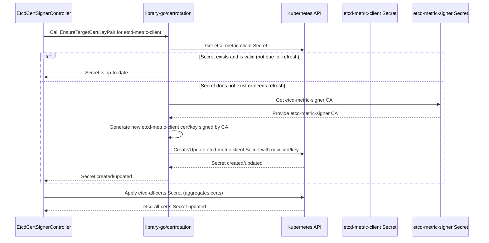

# etcd-metric-client Secret 分析

基于对 `cluster-etcd-operator` 代码库（特别是 `pkg/operator/etcdcertsigner/etcdcertsignercontroller.go` 和 `pkg/tlshelpers/tlshelpers.go` 文件）的分析，`etcd-metric-client` Secret 的管理方式如下：

**管理（创建与更新）：**

`etcd-metric-client` Secret 由 `EtcdCertSignerController` 管理。该控制器利用 `library-go` 的 `certrotation.RotatedSelfSignedCertKeySecret` 来处理存储在 Secret 中的证书和密钥对的生命周期。

1.  **初始化与周期性同步：** `EtcdCertSignerController` 配置为周期性地（每分钟）重新同步。在每次同步期间，会调用 `syncAllMasterCertificates` 函数。
    ```go
    // pkg/operator/etcdcertsigner/etcdcertsignercontroller.go
    return factory.New().ResyncEvery(time.Minute).WithInformers(
        // ... informers ...
    ).WithSync(syncer.Sync).ToController("EtcdCertSignerController", c.eventRecorder)
    ```
2.  **确保证书存在与轮换：** 在 `syncAllMasterCertificates` 中，会调用 `metricsClientCert.EnsureTargetCertKeyPair` 函数。这个由 `library-go` 提供的函数负责确保证书存在且有效。
    ```go
    // pkg/operator/etcdcertsigner/etcdcertsignercontroller.go
    _, err = c.certConfig.metricsClientCert.EnsureTargetCertKeyPair(ctx, metricsSignerCaPair, metricsSignerBundle)
    if err != nil {
        return fmt.Errorf("error on ensuring metrics client cert: %w", err)
    }
    ```
3.  **证书创建/更新逻辑：** `EnsureTargetCertKeyPair` 函数（`certrotation.RotatedSelfSignedCertKeySecret` 的一部分）会检查现有的 `etcd-metric-client` Secret。如果 Secret 不存在，或者其中的证书接近其刷新时间 (`etcdCertValidityRefresh`)，则会生成新的证书和密钥对。这个新证书由 `etcd-metric-signer` CA 签名。生成的证书和密钥随后存储在 `openshift-etcd` 命名空间中的 `etcd-metric-client` Secret 中。

**使用场景：**

`etcd-metric-client` Secret 包含一个用于身份验证的客户端证书。

1.  **Prometheus 到 etcd 指标认证：** 主要的使用场景是用于 Prometheus 从 etcd 抓取指标时的身份验证。这在文档中明确提及，并可从证书的 `UserInfo` 中推断出来。
    ```
    # docs/etcd-tls-assets.md
    | openshift-config/etcd-metric-signer (deprecated) | openshift-etcd/etcd-metric-client         | authn prometheus to etcd metrics | openshift-etcd-operator/etcd-metric-client |
    ```
    ```go
    // pkg/tlshelpers/tlshelpers.go
    func CreateMetricsClientCert(
        // ...
        recorder events.Recorder) certrotation.RotatedSelfSignedCertKeySecret {
        creator := &CARotatingTargetCertCreator{
            &certrotation.ClientRotation{
                UserInfo: &user.DefaultInfo{
                    Name:   "etcd-metric",
                    Groups: []string{"system:etcd", "etcd-metric"},
                },
            },
        }
        // ...
    }
    ```
2.  **Service Monitor 中的引用：** 该 Secret 在 Service Monitor 定义中被引用，Service Monitor 用于配置 Prometheus 收集 etcd 端点的指标。
    ```yaml
    # bindata/etcd/sm.yaml and bindata/etcd/minimal-sm.yaml
    tlsConfig:
      ca:
        secret:
          name: etcd-metric-ca-bundle
          key: ca-bundle.crt
      cert:
        secret:
          name: etcd-metric-client
          key: tls.crt
      keySecret:
        secret:
          name: etcd-metric-client
          key: tls.key
    ```

**过期时间：**

`etcd-metric-client` 证书具有明确的有效期和刷新阈值，以确保证书在过期前进行轮换。

1.  **有效期：** 证书有效期为 3 年。
    ```go
    // pkg/tlshelpers/tlshelpers.go
    const (
        // ...
        etcdCertValidity          = 3 * 365 * 24 * time.Hour
        etcdCertValidityRefresh   = 2.2 * 365 * 24 * time.Hour
        // ...
    )
    // ...
    func CreateMetricsClientCert(
        // ...
        recorder events.Recorder) certrotation.RotatedSelfSignedCertKeySecret {
        return certrotation.RotatedSelfSignedCertKeySecret{
            // ...
            Validity:    etcdCertValidity,
            Refresh:     etcdCertValidityRefresh,
            // ...
        }
    }
    ```
2.  **刷新阈值：** 证书配置为在 2.2 年后刷新。这种主动的轮换确保证书在其 3 年有效期到达之前得到更新，从而避免因证书过期导致的停机。

**时序图：**

以下是说明 `etcd-metric-client` Secret 管理过程的时序图：

